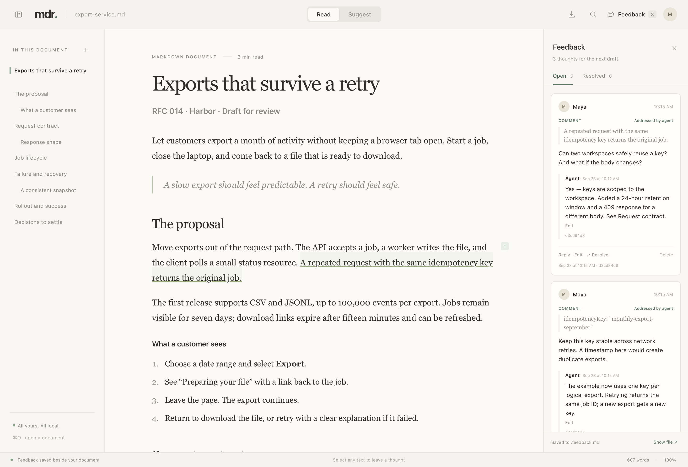
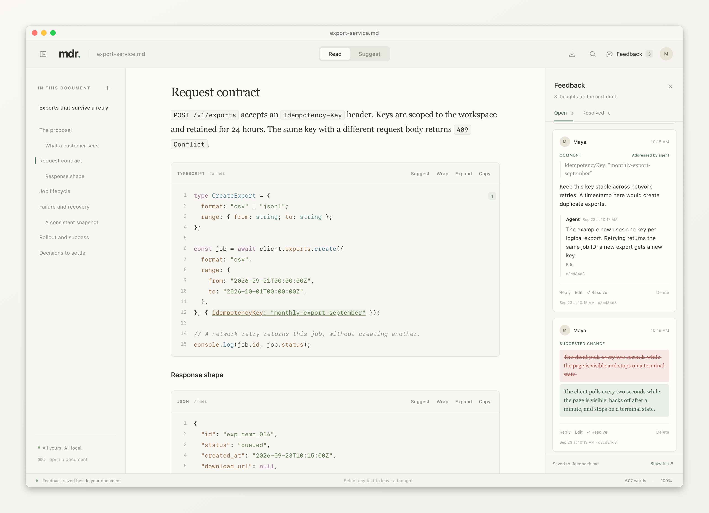
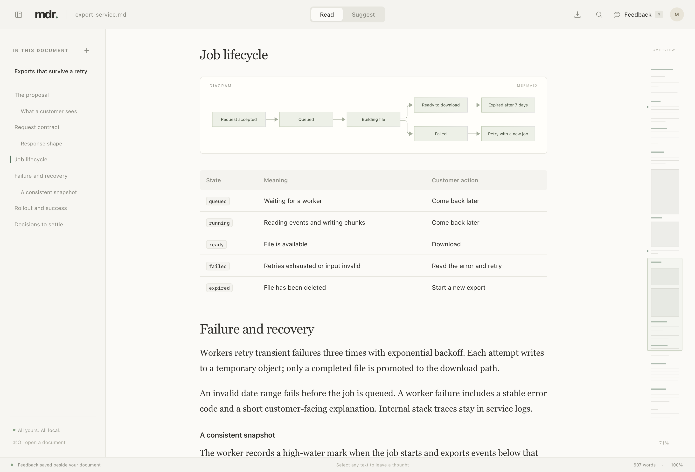

<p align="center">
  
</p>
<h1 align="center">mdr</h1>
<p align="center"><strong>Your agent writes the spec. You bring the judgment.</strong></p>
<p align="center">A beautiful, lightweight Mac reader for Markdown — with a live review conversation built in.</p>
<p align="center">
  <a href="https://github.com/izqui/mdr/releases/latest">Download for Mac</a> ·
  <a href="#review-with-your-agent">Agent setup</a> ·
  <a href="AGENT-REVIEW.md">CLI & feedback format</a>
</p>



Agents are good at producing documents. Reading them carefully still matters. So does putting the right comment on the exact passage that needs it.

mdr gives specs, plans, and technical proposals a quiet place to be read. Open a Markdown file, follow the outline, and study the code. Then anchor a question to a sentence or suggest a better version of a block. Your agent gets the feedback together with its exact context, and can reply in the same conversation while you keep reading.

```sh
mdr spec.md
```

## Made for the part where you think

- **Reading comes first.** Comfortable typography, a heading outline, a minimap, search, and paper, light, dark, or system appearance. File creation and update times sit quietly above the heading.
- **A whole folder, one reading space.** Open a specs directory, expand nested folders, and move between documents without opening more windows. Unsupported files stay visible, dimmed.
- **Code gets room.** Syntax highlighting, line numbers, copy, wrapping, expand controls, and precise comments or suggestions inside code blocks.
- **Diagrams belong in the doc.** Mermaid renders locally, alongside tables, lists, links, and prose.
- **Feedback stays in context.** Highlight to comment. Edit a passage to suggest a replacement. Reply, correct, and edit in threads.
- **Your agent can talk back.** Posted comments and agent replies travel through the same file. Both sides see updates live.
- **Take it with you.** Export a clean PDF with **⌘⇧P**. Follow relative Markdown links; links inside an open folder stay in the same window.

Native AppKit shell, system WebKit, no bundled browser runtime. No account, subscription, server, telemetry, or API key. The reader and review tools work offline; your coding agent is separate.

## Read a folder

```sh
mdr ./specs
```

Or choose **File → Open Folder…** (**⌘⇧O**). Expand folders in the **Files** tab,
click a Markdown document, and switch to **Outline** for its headings. Arrow keys
navigate the file tree; Return opens the selected document. **⌘B** hides or shows
the sidebar.

Only expanded folders are loaded and watched, so a large project can stay folded
away. New and removed files appear automatically. Other file types and feedback
sidecars are dimmed; open the original document to read its review. Hidden items
are omitted, and symbolic links are shown but not followed.

Switching documents saves an unfinished comment or suggestion as a draft. When
you return, choose **Continue draft** in Feedback. Each document retains its own
review file and reading position.

## The source stays yours

```text
spec.md             ← your document; edited by you or your agent
spec.feedback.md    ← full source snapshot + comments + suggestions + replies
```

Reviewing never changes the original. mdr saves feedback beside it, including the full Markdown body and inline machine-readable review records. Every message keeps its author, creation time, and the source version it was written against: modification time and SHA-256. Edits retain the original attribution and record the editor.

Typing autosaves. **Post** / **⌘↵** makes the message ready for the agent. The app watches both files, so replies appear while you read and source changes arrive without reopening. Exact quotes and nearby context help feedback follow edits. If a passage becomes ambiguous or disappears, mdr shows a conflict for you to reattach or resolve.



<sub>All screenshots use the fictional [Harbor export proposal](examples/export-service.md). The people, conversations, and identifiers are demo data.</sub>

<details>
<summary>See diagrams, tables, and the reading overview</summary>



</details>

## Install on your Mac

**macOS 14 or later · Apple Silicon and Intel**

1. Download the universal **DMG** from [Releases](https://github.com/izqui/mdr/releases/latest).
2. Open it and drag **mdr** to **Applications**.
3. Open mdr, then open a Markdown file with **⌘O** or by dragging it onto the app.

This early release is **ad hoc signed, not notarized by Apple**. After trying to launch it, macOS may require **System Settings → Privacy & Security → Open Anyway**. Follow [Apple's instructions](https://support.apple.com/en-us/102445) for the copy you trust. No system-wide security changes are needed. While this repository is private, downloads require a GitHub account with access to it.

The app ZIP is also available if you prefer it to the DMG. Releases include `SHA256SUMS` for checking downloaded assets.

### Set up `mdr` in Terminal

Accept **Install Command** when the app first opens, or choose **mdr → Install Terminal Command…** later. It installs a link in `~/.local/bin`. No alias or administrator password is needed.

If Terminal says `command not found`, add this line to `~/.zshrc` (or your shell's configuration), then open a new Terminal:

```sh
export PATH="$HOME/.local/bin:$PATH"
```

```sh
mdr "path/to/My spec.md"
mdr "path/to/specs"
mdr --help
mdr skill
```

The app does not silently edit your shell configuration. If you move mdr after setting up the command, run **Install Terminal Command…** again. An unrelated command named `mdr` is never overwritten. To use a different bin directory:

```sh
/Applications/mdr.app/Contents/MacOS/mdr --install-cli "$HOME/bin"
```

To make mdr your default Markdown reader: in Finder, select an `.md` file → **Get Info** → **Open with: mdr** → **Change All…**.

## Review with your agent

Install the small, bundled skill so your agent knows the whole loop:

```sh
# Codex — available across your projects
mdr skill --install "$HOME/.agents/skills/mdr"

# Claude Code — available across your projects
mdr skill --install "$HOME/.claude/skills/mdr"
```

These use the documented [Codex](https://developers.openai.com/codex/skills/) and [Claude Code](https://code.claude.com/docs/en/skills) skill locations. For a shared project setup, use `.agents/skills/mdr` or `.claude/skills/mdr` inside that project instead. The installer refuses to replace an existing skill; move your previous copy aside when updating. Restart the agent if the new skill does not appear.

The same [`skills/mdr`](skills/mdr) folder is included as `mdr-skill.zip` in every release. Unzip it into your agent's skills directory if you prefer manual installation. For agents without skill support, ask them to read the output of `mdr skill`.

Then tell your agent:

> Open the spec in mdr. Watch my posted feedback while I review. Make the changes, and reply in each thread with what you did. Mark completed work addressed so I can check it.

The agent runs:

```sh
mdr feedback watch spec.md
```

And, after making a change:

```sh
mdr feedback reply spec.md NOTE_ID \
  --author "Agent" --body-file reply.md --addressed
```

The watcher waits for the first feedback file, emits JSON changes, and skips unfinished drafts. The agent must keep the process running **and read its output**; mdr does not launch an AI model. Agents can also start threads, suggest changes, edit their replies, and resolve or reopen discussions. **Addressed** means ready for your check; **resolved** closes the thread.

Read the [agent guide](AGENT-REVIEW.md) for commands, retries, provenance, and safe concurrent writes.

## A few useful keys

| Action | Shortcut |
| :--- | :--- |
| Open / find | ⌘O / ⌘F |
| Comment on selection | ⌘⌥M |
| Toggle suggestions | ⌘⇧E |
| Post comment, reply, or suggestion | ⌘↵ |
| Show feedback | ⌘⇧R |
| Export PDF / print | ⌘⇧P / ⌘P |
| Toggle outline | ⌘B |
| Appearance and reviewer name | ⌘, |

Your avatar opens the reviewer and appearance settings. Exported PDFs contain the rendered document, with wrapped code and diagrams; review panels and controls are left out.

## Build from source

Requires **Xcode 26+**, its command line tools, **Swift 6**, **Node.js 24+**, and **Python 3**. Node and Python are build/test tools and are not required to run the app. The Xcode asset compiler produces the modern Mac icon and Retina fallbacks.

```sh
git clone https://github.com/izqui/mdr.git
cd mdr
npm ci
npm run build
open dist/mdr.app

# Optional: install/update in ~/Applications and set up ~/.local/bin/mdr
./scripts/install.sh
```

The build creates a universal app with both `arm64` and `x86_64` binaries. Installation paths are derived from the current user's home directory. Set `MDR_APPLICATIONS_DIR` and `MDR_BIN_DIR` to choose other destinations.

For tests, architecture, screenshot reproduction, and release publishing, see [CONTRIBUTING.md](CONTRIBUTING.md).

## Good to know

- Files must be UTF-8 and at most 8 MB. Suggestions replace one paragraph, heading, list-item paragraph, table cell, or code block at a time.
- Reattachment is conservative, based on quotes and context. Rewritten passages may need human judgment.
- Local images inside the document's folder are supported. Remote images and images outside that folder appear as captions. Raw HTML is shown as text.
- Feedback files contain the **full document**, reviewer names, timestamps, and the source's local path. Treat them with the same care as the source. They are ignored in this repository by default.
- The app does not apply suggestions, run code from documents, or synchronize files to a service. External links open in your browser when clicked.
- Releases currently require the first-open approval described above. Developer ID signing and notarization are not configured yet.

[MIT licensed](LICENSE). Built with Swift, [markdown-it](https://github.com/markdown-it/markdown-it), [Mermaid](https://github.com/mermaid-js/mermaid), [highlight.js](https://github.com/highlightjs/highlight.js), and [Turndown](https://github.com/mixmark-io/turndown). The app includes license notices for bundled dependencies.
