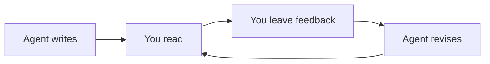

# A little room to think.

Your agent did the writing. Now make it yours.

mdr is a quiet place to read Markdown, think clearly, and leave feedback that your agent can actually use. Open a spec, settle in, and follow the ideas.

> Good feedback starts with a good read.

## Read without the noise

Headings live in the outline to your left. The minimap on your right gives you a sense of the whole document. Everything in between is space for the words.

Tables, code, and Mermaid diagrams belong here too. Your document stays on your Mac, and the reader works offline.

## Leave a little clarity

Select a passage to leave a **comment**. Or switch to **Suggest** and click a paragraph to edit it right where it lives. Your proposed words stay separate from the author's words. Drafts save as you type. Press **⌘↵** to post when the thought is ready.

Every comment is a thread. Use **Reply** to add a clarification below it, or **Edit** to correct a comment or reply. Cancel restores the last posted text.

Your agent can watch with `mdr feedback watch file.md`, add its own comments, and reply directly in the same feedback file. Replies appear here live. Give the agent `mdr skill` to learn the workflow.

| When you want to… | Just… |
| :--- | :--- |
| Ask a question | Select text → Comment |
| Propose better words | Switch to Suggest → click a paragraph |
| See the conversation | Open Feedback |
| Get back to reading | Press Escape |

## Give your agent the thread

The first piece of feedback creates a sibling file:

```text
spec.md             ← the original, untouched
spec.feedback.md    ← the full document + your notes
```

Every note remembers who wrote it, when it was written, and the exact document revision it belongs to. Give the feedback file to your agent and keep the conversation moving.

## Stay together as things change



When the original changes, mdr finds your notes in the new version. If a passage was rewritten or the match is ambiguous, the note asks for your attention. Nothing gets silently dropped.

## Make yourself at home

Choose paper, light, or dark in the appearance menu. Set your reviewer name once. Then open a Markdown file with **⌘O**, or from your terminal:

```sh
mdr path/to/your-spec.md
```

Less interface. More understanding.
