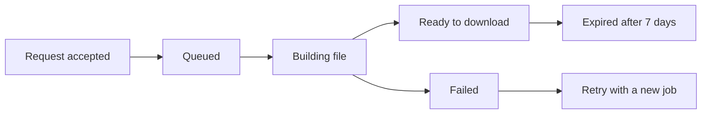

# Exports that survive a retry

**RFC 014 · Harbor · Draft for review**

Let customers export a month of activity without keeping a browser tab open. Start a job, close the laptop, and come back to a file that is ready to download.

> A slow export should feel predictable. A retry should feel safe.

## The proposal

Move exports out of the request path. The API accepts a job, a worker writes the file, and the client polls a small status resource. A repeated request with the same idempotency key returns the original job.

The first release supports CSV and JSONL, up to 100,000 events per export. Jobs remain visible for seven days; download links expire after fifteen minutes and can be refreshed.

### What a customer sees

1. Choose a date range and select **Export**.
2. See “Preparing your file” with a link back to the job.
3. Leave the page. The export continues.
4. Return to download the file, or retry with a clear explanation if it failed.

## Request contract

`POST /v1/exports` accepts an `Idempotency-Key` header. Keys are scoped to the workspace and retained for 24 hours. The same key with a different request body returns `409 Conflict`.

```typescript
type CreateExport = {
  format: "csv" | "jsonl";
  range: { from: string; to: string };
};

const job = await client.exports.create({
  format: "csv",
  range: {
    from: "2026-09-01T00:00:00Z",
    to: "2026-10-01T00:00:00Z",
  },
}, { idempotencyKey: "monthly-export-september" });

// A network retry returns this job, without creating another.
console.log(job.id, job.status);
```

### Response shape

```json
{
  "id": "exp_demo_014",
  "status": "queued",
  "created_at": "2026-09-23T10:15:00Z",
  "download_url": null,
  "error": null
}
```

`GET /v1/exports/exp_demo_014` returns the current status. The client polls every two seconds while the page is visible and stops on a terminal state.

## Job lifecycle



| State | Meaning | Customer action |
| :--- | :--- | :--- |
| `queued` | Waiting for a worker | Come back later |
| `running` | Reading events and writing chunks | Come back later |
| `ready` | File is available | Download |
| `failed` | Retries exhausted or input invalid | Read the error and retry |
| `expired` | File has been deleted | Start a new export |

## Failure and recovery

Workers retry transient failures three times with exponential backoff. Each attempt writes to a temporary object; only a completed file is promoted to the download path.

An invalid date range fails before the job is queued. A worker failure includes a stable error code and a short customer-facing explanation. Internal stack traces stay in service logs.

### A consistent snapshot

The worker records a high-water mark when the job starts and exports events below that mark. An event arriving during the export belongs to the next run. All chunks share the same mark.

## Rollout and success

- Start with a small opt-in cohort and one worker per workspace.
- Measure queue time, completion time, retries, and expired downloads.
- Target: 95% of 100,000-event exports finish within one minute.
- Keep the existing synchronous path until the new flow meets that target.

## Decisions to settle

- Should cancellation ship in the first version?
- Do we notify by email, or keep completion inside the product?
- Should CSV include columns that have no values in the selected range?

---

*This is a fictional product proposal made for the mdr demo. Names, identifiers, and review conversations are examples.*
