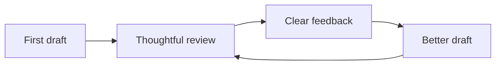

# A quieter workspace

A place for focused work, built around the way you think.

This proposal describes a workspace that brings your documents, decisions, and conversations into one calm place. It should feel less like managing software and more like sitting down with a clear desk.

> The best workspace is the one you stop noticing.

## The idea

Knowledge work is full of small interruptions. A question lives in chat, its answer in a document, and the decision in someone's memory. We want to close those gaps without adding another layer of administration.

The workspace is organized around **projects**, each with a small collection of living documents. An agent helps with the first draft; a person brings judgment, context, and taste.

### Principles

- **Start with the document.** Writing is the clearest way to think together.
- **Keep a visible history.** Every meaningful change has a person and a reason.
- **Make the next step obvious.** A reader should know what needs their attention.
- **Respect the quiet.** Notifications are a last resort, not the default.

## How it works

The loop is intentionally short. Write something, read it carefully, and leave the kind of feedback that makes the next draft better.



### A document has three layers

| Layer | Purpose | Who owns it |
| :--- | :--- | :--- |
| The source | A shared version of the idea | Author |
| The conversation | Questions, suggestions, and decisions | Reviewers |
| The history | How the idea changed over time | Everyone |

Keeping these layers separate means a review can be candid without making the original harder to read.

## The reading experience

Opening a document should feel instant. The text is the main event: generous margins, comfortable line lengths, and typography that makes a long specification feel approachable.

Navigation sits at the edges. An outline helps you understand the structure; a minimap gives you a sense of where you are. Both should be easy to ignore when you're in the flow.

### Feedback in context

A reviewer can select a phrase to ask a question, or edit a sentence to propose something better. Suggestions appear alongside the original so the author can understand both the change and its intent.

```typescript
type Review = {
  author: string;
  createdAt: string;
  sourceVersion: string;
  feedback: Comment | Suggestion;
};
```

## What success looks like

1. A new reader understands the proposal in one sitting.
2. A reviewer leaves useful feedback without learning a tool.
3. An agent can act on every note without guessing its context.
4. The source document remains a clean record of the current idea.

## Open questions

- How should we show feedback that spans several revisions?
- What is the smallest useful unit of a suggestion?
- When does a conversation deserve its own document?

---

Good tools leave room for good thinking.
